# Prevendo os preços das casas com Machine Learning
Este repositório contém script de um modelo capaz de prever o preço de aluguel de imóveis com base em um conjunto de variáveis do setor imobiliário

 

# _Objetivo do projeto_

O objetivo deste projeto é desenvolver um modelo de previsão de preços de aluguel de imóveis utilizando técnicas de ciência de dados. O modelo será capaz de estimar o valor do aluguel com base em um conjunto de variáveis do setor imobiliário.

 

# _1. Problema de Negócio_

O mercado imobiliário enfrenta o desafio de precificar os aluguéis de forma precisa, levando em consideração diferentes características dos imóveis. A falta de um modelo confiável de previsão de preços pode levar a decisões equivocadas e a perda de oportunidades de negócio.

Fonte: Os dados de negócio são dados imobiliário

 

# _2. Justificativa_

- **Por quê:** A utilização de técnicas de ciência de dados permite analisar um conjunto de variáveis do setor imobiliário e identificar padrões e relações que influenciam os preços de aluguel. Com um modelo preciso de previsão, os stakeholders do mercado imobiliário podem tomar decisões mais informadas, otimizar os preços dos aluguéis e aumentar a eficiência de suas operações.
- **Como:** O projeto será desenvolvido seguindo um pipeline de ciência de dados, que inclui etapas como análise exploratória dos dados, pré-processamento, seleção e treinamento de modelos de regressão, construção de uma API e avaliação do desempenho do modelo. Serão utilizados métodos como regressão linear, árvore de decisão, regressão logística e redes neurais para encontrar o modelo que melhor se ajuste aos dados e forneça previsões precisas.
- **O quê:** A entrega final será um notebook contendo todo o processo de modelagem, desde a coleta e limpeza dos dados até a implementação da API para utilização em um ambiente comercial. O modelo de previsão de preços de aluguel desenvolvido será uma ferramenta valiosa para o mercado imobiliário, auxiliando na tomada de decisões estratégicas e aumentando a eficiência operacional das empresas do setor.

 

# _3. Premissas_

As variáveis originais do conjuto de dados são: 

Variável | Definição
------------ | -------------
Age | idade das pessoas|
city | lugar do imóvel
area | área em metros quadrados do imóvel
rooms | quantidade de quartos
bathroom | quantidade de banheiros
parking spaces | vaga de garagem
floor | andar do imóvel
animal | se aceita animal
furniture | se esta mobiliado
hoa (R$) | o valor de condomínio
rent amount (R$) | valor de aluguel
property tax (R$) | valor do iptu
fire insurance (R$) | valor do seguro de incêndio
total (R$) | valor total somando todos os valores

Não vamos usar todos os atributos, porque algumas colunas não faz sentido para esse projeto que seria:

  - fire insurance (R$)
  - total (R$)

 

# _4. Planejamento da Solução_

0. **ENTENDIMENTO DO NEGÓCIO**

Definição do problema: É importante definir claramente qual é o problema a ser resolvido ou a pergunta a ser respondida. É preciso entender o objetivo do projeto e a relevância do problema.

    - Descrição do negócio
    - Planejamento da solução

1. **IMPORTANDO AS BIBLIOTECAS**

Importação de bibliotecas: Nesta etapa, as bibliotecas necessárias para o desenvolvimento do modelo de machine learning são importadas. Isso inclui bibliotecas para manipulação de dados, visualização, modelagem e avaliação.

2. **COLETA DOS DADOS**

Coleta de dados: Nesta etapa, os dados são coletados a partir de diversas fontes, como bases de dados, APIs, arquivos de texto, imagens, etc.

3. **FUNÇÕES AUXILIARES**

Funções auxiliares: Nesta etapa, são criadas funções que irão auxiliar na manipulação e no processamento dos dados, na modelagem e na avaliação do modelo de machine learning. Essas funções são utilizadas em etapas posteriores do projeto.

4. **ANÁLISE EXPLORATÓRIA DOS DADOS**

Análise exploratória de dados: Nesta etapa, os dados são analisados para identificar possíveis padrões, tendências, correlações e informações relevantes que possam auxiliar na construção do modelo de machine learning. É importante entender os dados coletados, avaliar a qualidade dos dados e identificar quaisquer problemas ou limitações.

    - **Passo 1:** Análise Descritiva dos Dados
        - Esta etapa consiste na descrição estatística dos dados coletados, como média, mediana, desvio padrão, entre outros.
    - **Passo 2:** Exploração de Dados
        - Nesta etapa, os dados são visualizados e analisados graficamente para identificar padrões e relações entre as variáveis.

5. **PRÉ-PROCESSAMENTO**

Preparação de dados ou Pré-processamento de dados: Nesta etapa, os dados são limpos, transformados e preparados para serem utilizados no modelo de machine learning. Isto inclui tarefas como normalização, codificação, preenchimento de valores ausentes, remoção de outliers, etc.

Divisão dos dados em conjuntos de treinamento e teste: Nesta etapa, os dados são divididos em conjuntos de treinamento e teste para avaliar o desempenho do modelo.

6. **TREINAMENTO ALGORITMOS DE MACHINE LEARNING**

Modelagem ou Seleção do modelo: Nesta etapa, um modelo de machine learning é escolhido com base na tarefa a ser realizada e nos dados disponíveis.

Treinamento do modelo: Nesta etapa, o modelo é treinado utilizando o conjunto de treinamento.

7. **AJUSTE FINO DE HIPERPARÂMETROS**

Ajuste de hiperparâmetros: Nesta etapa, os hiperparâmetros do modelo são ajustados para obter melhores resultados.

8. **AVALIAÇÃO DO ALGORITMO**

Avaliação de modelo: Nesta etapa, o modelo é avaliado utilizando o conjunto de teste para verificar a sua capacidade de generalização para dados não vistos durante o treinamento.

9. **IMPLEMENTAR O MODELO PARA A PRODUÇÃO**

Implantação: Nesta etapa, o modelo é implantado em um ambiente de produção para utilização em situações reais para resolver o problema.

10. **INSIGHTS**

Nesta etapa, são identificadas as principais descobertas e conclusões do projeto.

11. **PRÓXIMOS PASSOS**

Nesta etapa, são definidos os próximos passos a serem tomados com base nos resultados obtidos e nos insights identificados. Isso pode incluir melhorias no modelo existente, coleta de mais dados, exploração de diferentes modelos, entre outros.

 

# _5. Insights_

*Resumo dos insights durante análise exploratória de dados (EDA):*

**1º Tabela: Área em metros quadrados dos imóveis no Brasil**

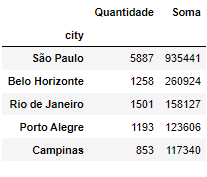

 

**Nota:**
- São Paulo tem a maior área em metros quadrados e a maior em quantidade para locação.

**2º Tabela: Análise dos imóveis com as maiores áreas em metros quadrados**

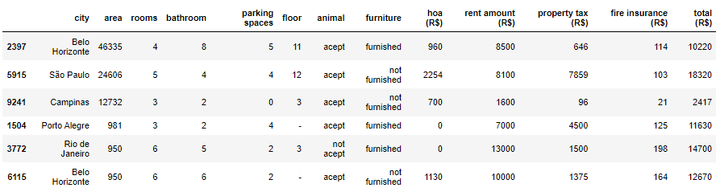

 

**Nota:**

Filtrando os imóveis com a maior área em metros quadrados:

- Ter um imóvel com a maior área em metros quadrados, não quer dizer que é o maior valor de para locação.

- Para a cidade de Belo Horizonte, podemos notar que o imóvel com a maior área, que está disponível para locação, possui 4 quartos, 8 banheiros e 5 vagas de estacionamento, porém possui um valor de condomínio (HOA) de R$ 960,00.

    - O segundo imóvel nesta cidade, tem uma área de 950m², possui 6 quartos, 6 banheiros e 2 vagas de estacionamento, mas possui um valor de condomínio (HOA) mais alto, de R$ 1.130,00.    

- Já para São Paulo, o imóvel com maior área disponível para locação possui 5 quartos, 4 banheiros e 4 vagas de estacionamento. No entanto, seu valor de condomínio é de R$ 2.254,00, um dos maiores da base de dados.    

- Para Campinas, a área do imóvel disponível é intermediária em comparação aos outros estados. Ele possui 3 quartos, 2 banheiros e não possui vagas de estacionamento. Seu valor de condomínio é de R$ 700,00.    

- Porto Alegre possui o menor imóvel disponível para locação dentre as cidades da base de dados, com uma área de apenas 981m². O imóvel possui 3 quartos, 2 banheiros e 4 vagas de estacionamento. Ele é o único da base de dados que não possui informações sobre o andar em que se encontra.    

- No Rio de Janeiro, o imóvel disponível para locação possui uma área de 950m² e possui 6 quartos e 5 banheiros, com 2 vagas de estacionamento. Ele é o único da base de dados que não aceita animais.

**3º Tabela: Análise dos imóveis com as menores áreas em metros quadrados**

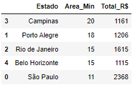

 

**Nota:**

- A cidade de São Paulo com a menor área em metros tem o maior valor de locação, com um total de R$ 2.368.

**1º Gráfico:**

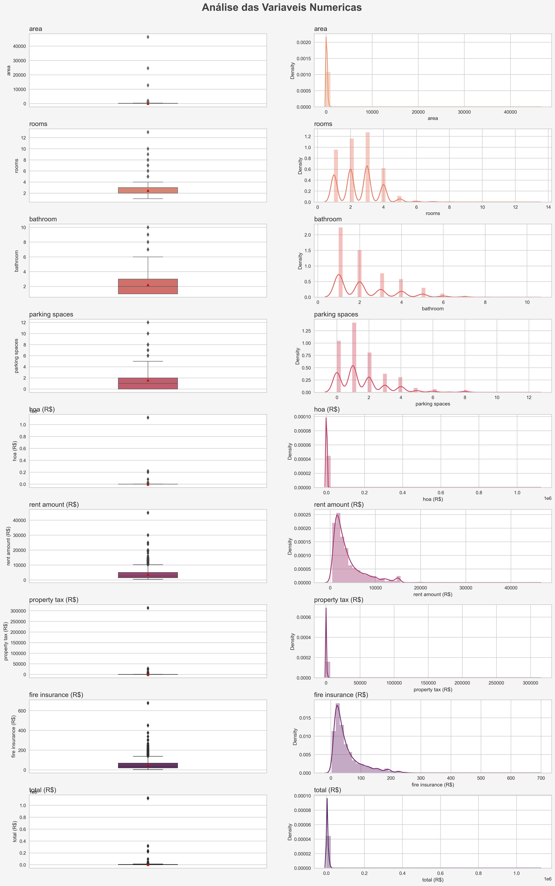

 

**Nota:**

- Area:
    - BoxPlot: temos a presença de outliers, que está impedindo da caixa ser criada.
    - Distplot: quando olhamos para a densidade os nossos dados estão concentrados abaixo de 10 mil.
    - Talvez venha valer a pena em criar um filtro para tirar a presença dos outliers, para ver como está distribuição dos dados.

- Room:
    - BoxPlot: A caixa está mais distribuida, podemos ver a presença de outliers, que indica, que temos alguns imóveis tem uma quantidade maior de quartos.
    - Distplot: a densidade deles está entre 1 a 3.

- Bathroom:
    - BoxPlot: podemos ver que o mínimo é um banheiro, que pode indicar, que não tem imóvel sem a presença de banheiro no imóvel.

- Parking spaces:
    - BoxPlot: podemos ver que existe o valor zero, que é possível ter imóvel que não tem garagem.

- Hoa:
    - BoxPlot: tem a presença de outliers, que indica, que temos alguns condomínios com valor absurdamente elevado, pode ser um erro de tabulação e isso pode distorcer as previsões, ainda mais com modelos lineares.

- Rent amount (variável que vamos tentar fazer a previsão):
    - BoxPlot: tem a presença de outliers
    - Distplot: mostra que temos um imóvel acima de 40 mil reais, isso pode ser verdade, pode ser uma casa específica que realmente custa esse valor.

- Property tax:
    - BoxPlot: tem a presença de outliers

 

# _6. Modelos de Machine Learning_

_**Foi usado cinco algoritmos para construir o modelo de previsão de preços de aluguel de imóveis:**_

1. Average Model
2. Random Forest Regressor
3. Linear Regression Model
4. Linear Regression Regularized Model - Lasso
5. XGBoost Regressor

_**Comparar o desempenho dos modelos de machine Learning:**_

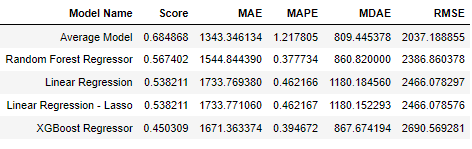

 

**Nota:**

- O resultado acima mostra as métricas de avaliação de desempenho de cinco modelos de regressão diferentes:
    - Average Model, Random Forest Regressor, Linear Regression, Linear Regression - Lasso e XGBoost Regressor.
    - Para avaliar qual modelo tem a melhor performance é necessário comparar as métricas para cada modelo.

Qual modelo devemos usar em produção?
- Random Forest Regressor, porque temos um MAPE de 37% e um RMSE de R$ 2.386.
- Mas vamos fazer o hiperparâmetros dos algoritmos.

_**Comparar o desempenho dos modelos de machine Learning - hiperparâmetros:**_

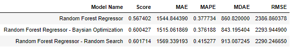

 

**Nota:**

Hiperparâmetros (significa que o modelo passou por otimização de hiperparâmetros)

- **MAE:** Quanto menor o valor do MAE, melhor é a precisão do modelo. O MAE é menos sensível a valores discrepantes (outliers) em comparação com outras métricas, como o RMSE.
- **MAPE:** é uma medida de erro percentual que calcula a média do valor absoluto das diferenças entre os valores reais e previstos, dividido pelo valor real. É uma medida comumente usada em problemas de previsão de demanda e vendas.
- **MDAE:** Esse método é menos sensível a valores discrepantes do que o MAE e é uma boa opção quando os dados apresentam outliers.

- A escolha da métrica adequada depende do contexto e dos objetivos do problema em questão. É importante avaliar diferentes métricas e comparar os resultados de diferentes modelos para escolher o melhor modelo para a aplicação em questão.

- O modelo "Random Forest Regressor Baysian Optimization" tem o segundo menor MAE (Mean Absolute Error) e MDAE (Median Absolute Error), o que sugere que ele é mais robusto aos outliers do que os outros modelos. Além disso, o MAPE (Mean Absolute Percentage Error) é semelhante aos outros modelos, o que indica que ele não está superestimando ou subestimando drasticamente as previsões.

Portanto, se você deseja escolher o modelo que lida melhor com outliers, o "Random Forest Regressor Baysian Optimization" pode ser a escolha mais adequada.

Superestimar significa fazer uma estimativa ou avaliação que é maior do que o valor real ou esperado. É o oposto de subestimar, que é quando a estimativa é menor do que o valor real ou esperado. Em geral, a superestimação pode levar a expectativas irreais ou a decisões equivocadas, por isso é importante tentar evitar superestimar sempre que possível.

_**Modelo final:**_

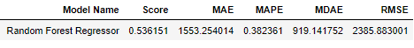

 

**Nota:**

- O valor de 1.553 é o erro absoluto médio entre as previsões do modelo e os valores reais da variável resposta. Em outras palavras, em média, as previsões do modelo estão errando em 1.553 em relação aos valores reais da variável resposta. Isso não significa que o modelo está produzindo resultados melhores que a variável resposta. Pelo contrário, o erro absoluto médio indica que o modelo ainda tem uma margem considerável de erro e precisa ser melhorado.

- A média da variável resposta de 4.574 indica que esse é o valor que se espera em média para a variável resposta. O modelo está errando em média em 1.553, ou seja, em torno de 34% desse valor médio. O objetivo é sempre minimizar o erro absoluto médio e o erro percentual médio, ou seja, fazer com que esses valores sejam o mais próximo possível de zero. Portanto, podemos concluir que o modelo não está prevendo a variável resposta com alta precisão e que ainda precisa ser melhorado.

- O MAPE de 38% também indica que o modelo precisa ser melhorado. Idealmente, o erro absoluto médio e o erro percentual médio deveriam ser o mais próximo possível de zero, indicando que o modelo está prevendo os valores da variável resposta com alta precisão.

- Já o Erro percentual médio indica que o modelo está errando, em média, cerca de 33,99% em relação ao valor real da variável resposta.

- Em geral, um MAPE e um Erro percentual médio mais baixos indicam um desempenho melhor do modelo, pois significam que o modelo está prevendo os valores da variável resposta com maior precisão.

-  Valores discrepantes (outliers) podem ter um efeito significativo no desempenho do modelo de previsão, especialmente em modelos que são sensíveis a esses valores. Se houver um grande número de outliers na amostra de dados, pode ser útil identificá-los e removê-los do conjunto de dados para melhorar o desempenho do modelo.

- Eu usei o modelo Random Forest Regressor para aprender todos os comportamentos dos dados, depois conseguir fazer as predições.

 

# _7. Performance do Modelo de Machine Learning_

_**Criando a transformação para o time de negócio:**_

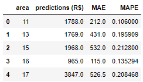

 

**Nota:**

- Para uma área de 11 metros quadrados do imóvel, o modelo indica um preço de aluguel no valor de 1.788 reais, podendo ter um erro médio de 212 reais para cima ou para baixo, que corresponde a 10%.

 

# _8. Resultado Negócio_

Após a escolha do nosso algoritmo, somos capazes de visualizar alguns cenarios do ponto de vista de negócio.

 

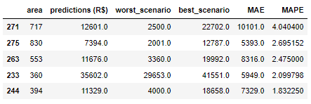

 

**Nota:**

- Para uma área de 717 metros quadrados, podemos ter uma receita de aluguel de 12.601 reais, mas temos um erro médio de 4%, então no pior cenário o preço do aluguel seria de 2.500 reais e no melhor cenário seria de 22.702 reais.

- Também podemos ver que vamos ter algumas áreas que vão ser mais desafiadoras que outras.

**Resumindo a condição dos cenários das áreas**

 

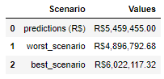

 

Desta forma facilita a tomada de decisão.

 

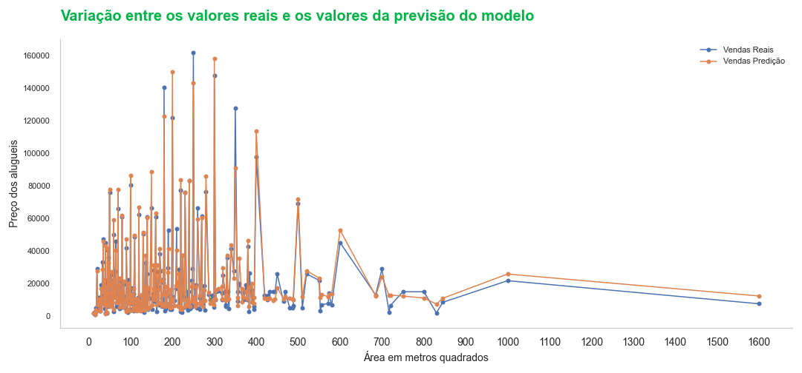

 

O gráfico esta mostrando que as predições estão bem próxima dos valores reais.

 

# _9. Conclusão_

A conclusão deste projeto é que foi desenvolvido um modelo de previsão de preços de aluguel de imóveis com base em um conjunto de variáveis do setor imobiliário. O modelo passou por todas as etapas de um pipeline de ciência de dados, incluindo análise exploratória dos dados, pré-processamento, seleção e treinamento de modelos de regressão. Através desse modelo, o mercado imobiliário agora possui uma ferramenta precisa e confiável para estimar os preços de aluguel de imóveis.

A construção da API permitiu a integração do modelo em um ambiente comercial, possibilitando sua utilização de forma prática e eficiente.

 

# _10. Próximos passos_

- Coletar mais informações para que o algoritmo possa aprender um comportamento das pessoas que tem a probabilidade em sair da empresa.

- Gerar novas features (Características), para alcançar um equilibrio e para manter o algoritmo complexo suficiente para ele entedener o comportamento, mas não tão complexo ao ponto dele decorar.
